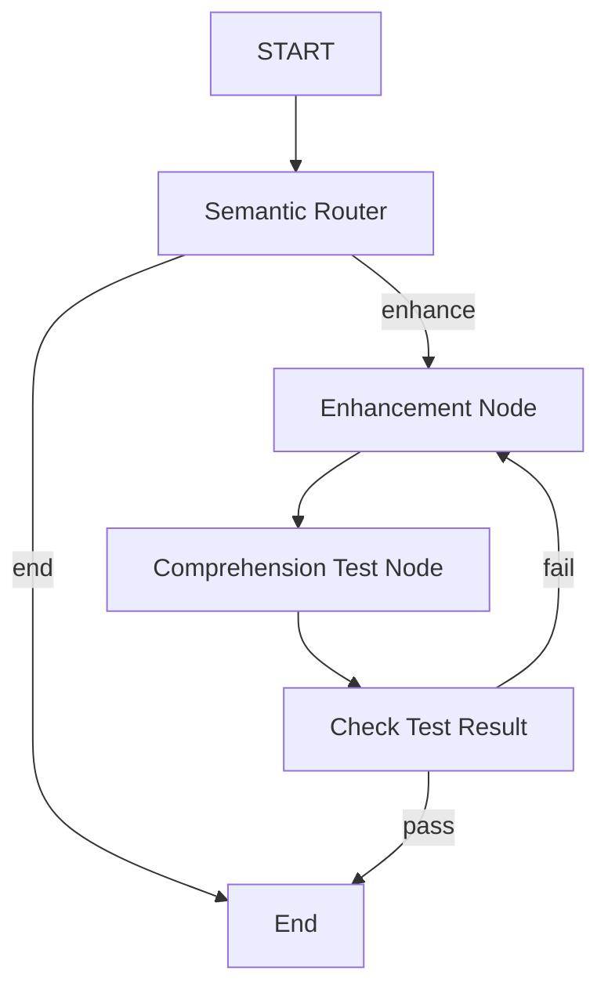
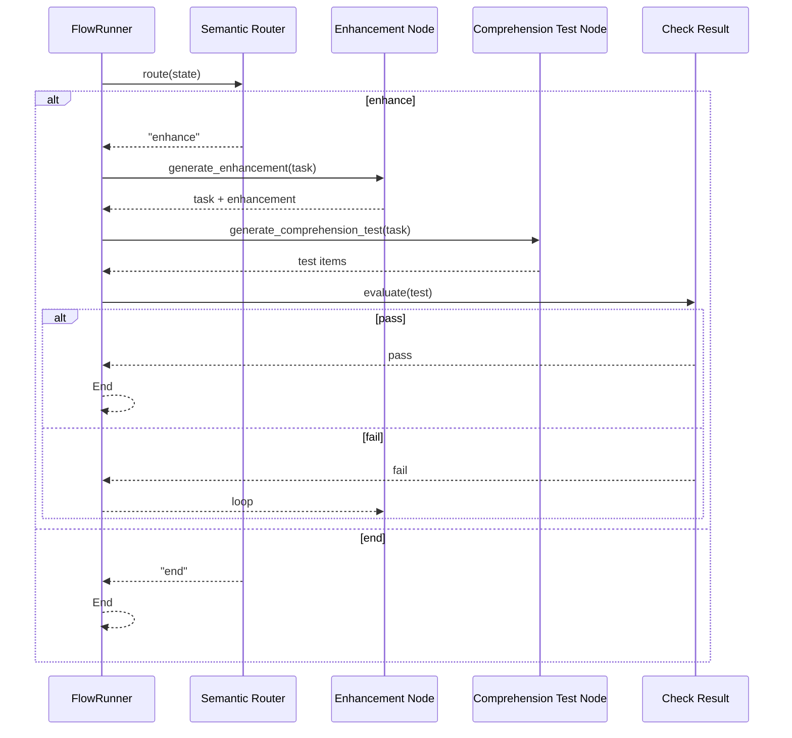

# Orchestrator Flow: Visual Guide

This document visualizes the end-to-end orchestration implemented in the `task_orchestrator` crate. It shows how tasks are routed, enhanced, tested for comprehension, and verified in a loop until completion.

## High-Level Flowchart

- Semantic Router selects a path based on the current state (e.g., whether a task needs enhancement).
- Enhancement Node generates improved task content using the TaskEnhancementPort (Ollama adapter in examples).
- Comprehension Test Node produces a short-answer quiz to validate understanding.
- Check Test Result either terminates the flow or loops back for further enhancement.

## Sequence Diagram

## Mapping to Code

- Graph assembly: `task_orchestrator::graph::assemble_orchestrator_flow`
- Runtime: `graph_flow::FlowRunner` (see run helper in `use_cases::run_task_with_flow`)
- Ports/Adapters:
  - `TaskEnhancementPort` -> Ollama-based adapter
  - `ComprehensionTestPort` -> Ollama-based adapter

## Tips

- Keep nodes small and single-purpose.
- Log transitions between nodes to aid debugging.
- Make routing decisions explicit in state to ensure deterministic behavior in tests.
