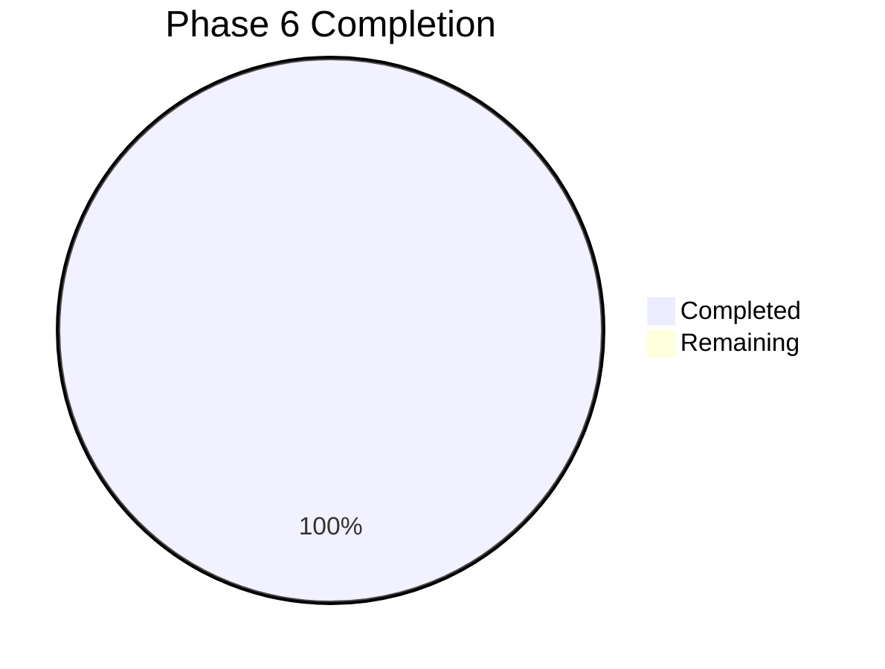
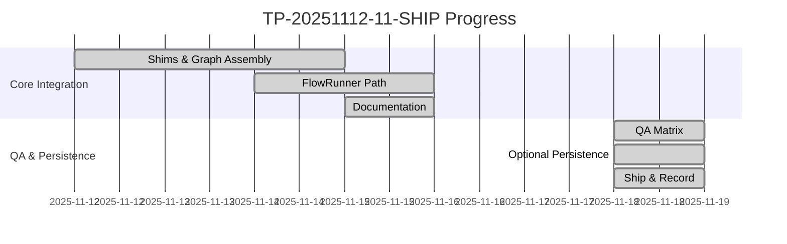
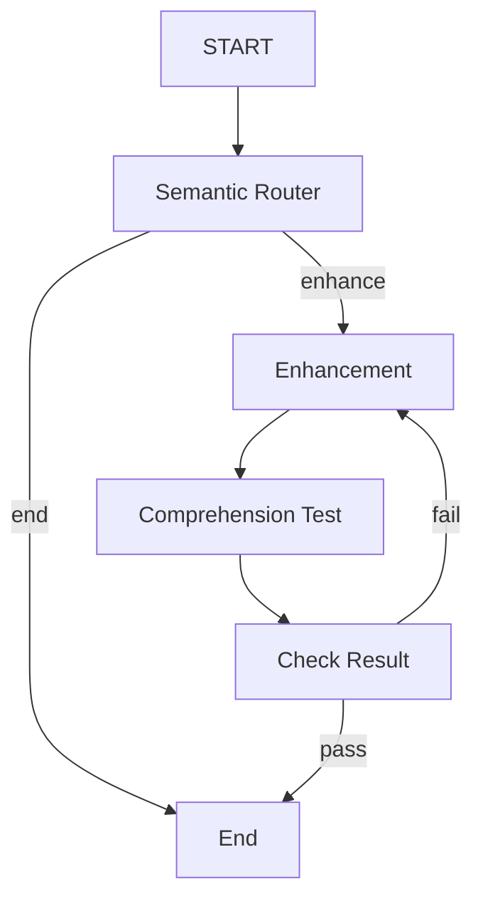

# Project Status Dashboard

Generated: 2025-11-18 11:48 (local)

This dashboard summarizes the current status of the rig-task-pipeline workspace with a focus on Phase 6 (task_orchestrator graph-flow integration). It includes visual progress, links to the plan and key modules, and the next actions required to ship.

## Phase 6 (TP-20251112-11-SHIP) Summary

- Status: Completed
- Completion: 24 of 24 checklist items complete (100%)
- Key Outcomes:
  - graph_flow Task shims implemented for all nodes (router, enhancement, comprehension, check) with unit tests
  - Graph assembled via GraphBuilder with conditional edges and build test
  - Unified FlowRunner path implemented in use_cases::run_task_with_flow with an end-to-end async test
  - SQLite-backed session storage integrated behind feature with smoke test
  - Documentation updated: crate README and a visual flow guide (docs/FLOW.md)

### Progress Chart

### Gantt Timeline (Indicative)

## Orchestration Visualization

For a detailed flow and sequence diagrams, see:
- Orchestrator Flow Visual Guide: docs/FLOW.md

High-level flow (implemented):

## Plan Link and Evidence

- Source of Record Plan: TASK_PLAN_SHIP.md
- Evidence in Code:
  - Graph Assembly: task_orchestrator/src/graph/assemble_orchestrator_flow.rs
  - Task Shims: task_orchestrator/src/graph/flow_shims/* (router, enhancement, comprehension, check, end)
  - Unified Runner: task_orchestrator/src/use_cases/run_task_with_flow.rs
  - Architecture Summary: task_orchestrator/src/architecture/describe_architecture.rs
  - Crate Overview: task_orchestrator/README.md

## QA Matrix

- [x] Run cargo test -p task_orchestrator (default)
  - Result: unit tests 37 passed; doc tests 2 passed; 0 failed (2025-11-18 10:10 local)
- [x] Run cargo test -p task_orchestrator --features sqlite_persistence
  - Result: unit tests 39 passed (incl. SQLite smoke); doc tests 2 passed; 0 failed (2025-11-18 11:24 local)
- [x] Run workspace tests
  - Result: all 37 tests passed; 0 failed (2025-11-18 11:40 local)
- [ ] Optional: run with additional features if needed in the future (sqlite_persistence)

## Notes

- The original plan referenced feature-gating for graph_flow. The codebase has unified on the graph_flow runtime without a gate, preserving default build stability and tests. This simplifies the matrix while maintaining HEXSER alignment.
- Persistence remains optional and is deferred; the decision is to use SQLite via sqlx when wiring is scheduled.
